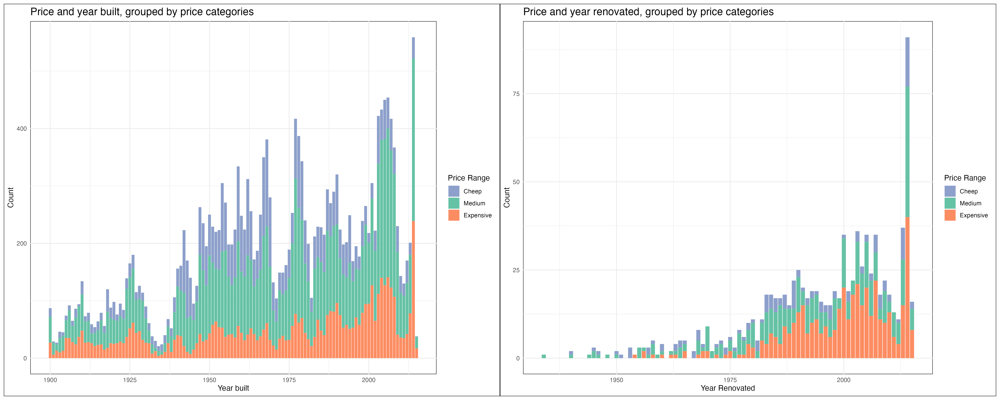
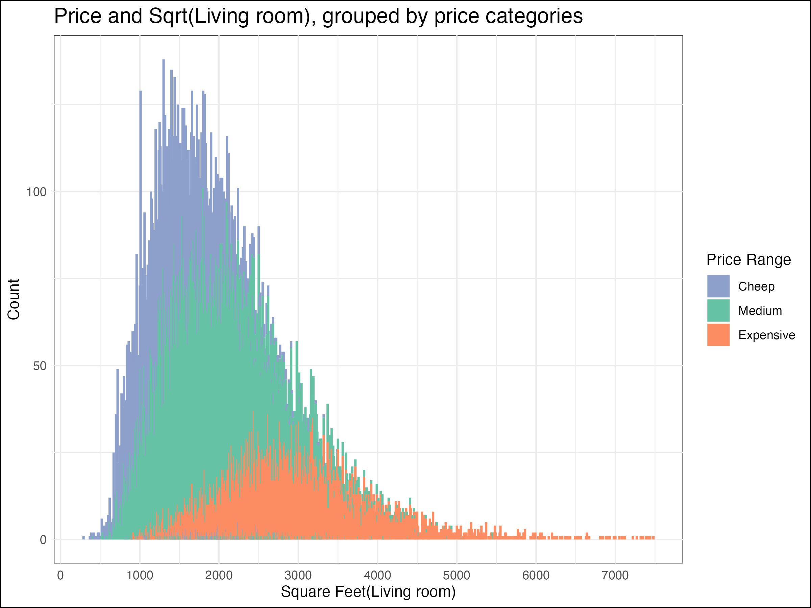
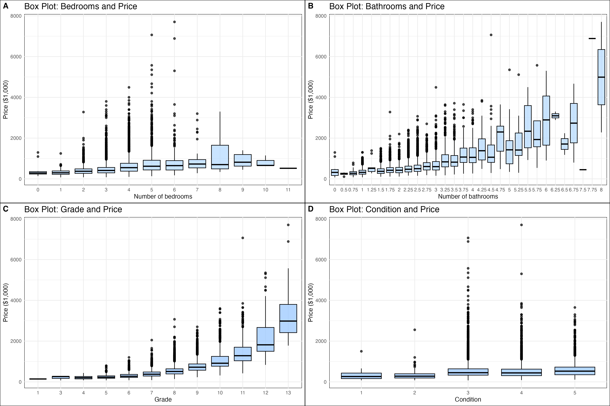
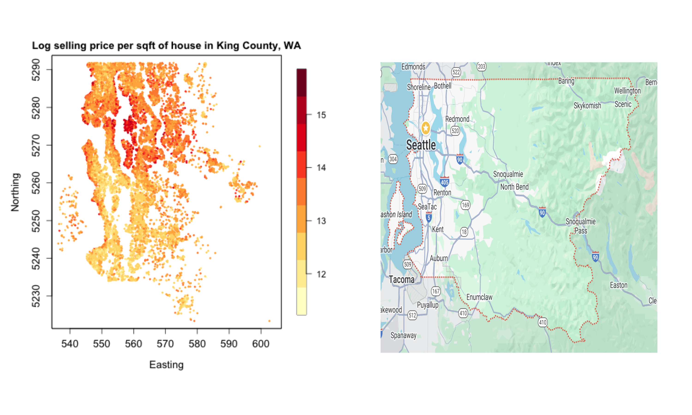

## King County Housing Sales Data Analysis: What factors influence house prices?

##### Gayoung Lee (MPH 2nd-year student, Applied Epidemiology)

##### 12/13/2023

### Introduction

This dataset contains house sale prices for King County, which includes Seattle. It includes homes sold between May 2014 and May 2015.The dataset comprises over 21,000 observations, encompassing variables such as price, sale date, bedrooms, bathrooms, zip code, square feet, grade, year built, year renovated, and 12 other factors (i.e., a total of 21 variables). With a focus on factors like year built, year renovated, square feet, and grade, I aimed to analyze the influences on house sale prices in King County in this period.

While it is expected that recently built or renovated homes, larger homes, and those with more bedrooms and bathrooms, as well as higher grades or better conditions, tend to have higher prices, my objective in this report is to provide insights into which factors gave a more significant influence. This will be achieved through the figures presented in the report.

I categorized prices into 'Cheap,' 'Medium,' and 'Expensive' based on the 1st and 3rd quartiles. Additionally, for better readability, I considered removing outliers in the graphs. Initially, I had planned to apply a logarithmic transformation to control for outliers, but to maintain the visual interpretability of the graphs, I decided not to apply the logarithm to the prices.

### Basic Analysis

#### Price

The first quartile of house prices was \$321,950, with a mean of \$540,088, and the third quartile was \$645,000. The minimum price was \$75,000, and the maximum was \$2,000,000.

#### Dealing with Outliers of Price

Recognizing the need to exclude outliers during analysis and visualization, I employed z-value calculations, considering values with z \> 3 as outliers. Consequently, as the price of \$2,000,000 had z \> 3, I decided to exclude outliers from the analysis except for three plots. For the three plots with price categories, outliers were categorized as 'Expensive' and were retained in the visualizations.

### Price and Year

The price categories are divided into three groups: 'Cheap' for prices at or below \$321,950 (1st quartile), 'Medium' for prices above \$321,950 and at or below \$645,000 (1st-3rd quartile), and 'Expensive' for prices above \$645,000 (3rd quartile). Through this grouping, we can easily visualize how prices are distributed overall.

The following two graphs illustrate how the price ranges are distributed based on the year built and year renovated. As evident from the second graph, most of the expensive homes have undergone renovations, and it's notable that not all recently built homes are necessarily expensive.

```{r console}

```

To visually assess whether the year built has a significant impact on price ranges, I employed a ridgeline plot. We can observe a slight increase in price ranges based on the year of construction, but overall, there is not a significant change.

```{r console}
knitr::include_graphics("./figure/FinalProject_Ridge.png")
```

Hence, I observed that the presence of renovations has a more pronounced impact on prices than the year built.

### Price and Square feet

Additionally, the graph below indicates that larger living room sizes correlate with higher selling prices. This finding aligns with common expectations, where larger living spaces tend to command higher prices.

```{r console}

```

The three graphs below depict the correlation between price and the area of the living room, above ground space, and basement. As evident from these graphs, there is a positive correlation between the area of these spaces and the price, as confirmed by the regression lines. It can be observed that a considerable number of houses, despite being sold at high prices, do not have a basement. The final graph illustrates the correlation between price and the year built, where the nearly horizontal regression line indicates a lack of significant correlation. This aligns with the findings we observed earlier.

Houses with the price of \$2,000,000 were excluded in our analysis.

```{r console}
knitr::include_graphics("./figure/FinalProject_Scatter.png")
```

### Price and Bathrooms / Grade

Now that we know that area has a positive correlation with price. I have also assessed how other categorical factors influence prices.

Contrary to my expectations, the number of bedrooms did not have a significant impact on the price. Instead, there was a noticeable increase in price with an increasing number of bathrooms. Furthermore, I examined how the grade (overall grade given to the housing unit based on the King County grading system) and condition (overall condition of the house) impact the house's price. Ultimately, it was observed that, rather than condition, the grade has a more significant influence on the selling price of the house.

If we aim to predict prices in King County, WA, the number of bathrooms and the grade could potentially serve as valuable predictors.

```{r console}

```

Initially, I assumed that as all factors in this dataset improved, the price would increase, making the results less intriguing. However, unexpectedly, it became evident that there are many factors that do not have a significant impact on the price.

### Price and Geographical Location

Lastly, as seen in the graph below, the housing sales in King County are more prevalent in the Seattle compared to the mountainous regions (eastern region of King County). Particularly, the Redmond area near the lakes stands out as the most expensive. For convenience, I have attached a Google Map image of King County.

```{r console}

```

### Conclusion

Through the analysis of housing sales data in King County spanning from May 2014 to May 2015, we investigated factors influencing house prices over the course of one year. As a result, we found that factors such as whether the property was renovated, the area size, the number of bathrooms, and the house's grade were more significant determinants of house prices compared to the year of construction, the number of bedrooms, and the overall condition. Furthermore, we observed that the geographic location plays a crucial role, with properties near lakes and in the Redmond area, where numerous high-tech companies are located, showing higher property values.

### Future Analysis

Analyzing the latitude and longitude data in our dataset along with information from Google Maps to identify amenities, schools, and other facilities in the areas where high-value transactions occurred from 2014 to 2015 could enhance our ability to predict house prices more accurately.
